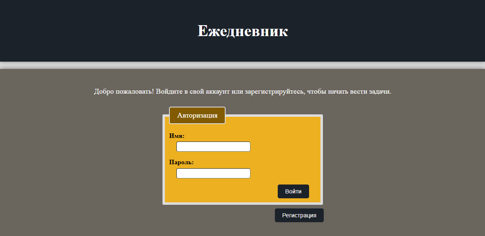
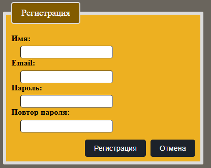
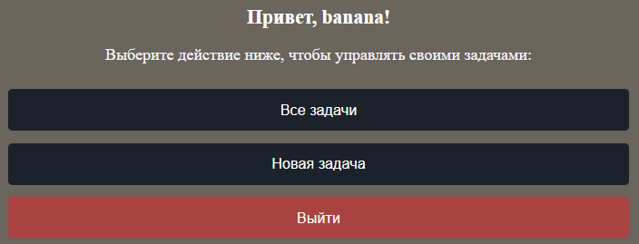
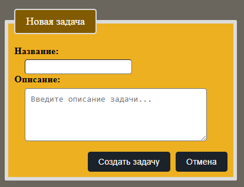
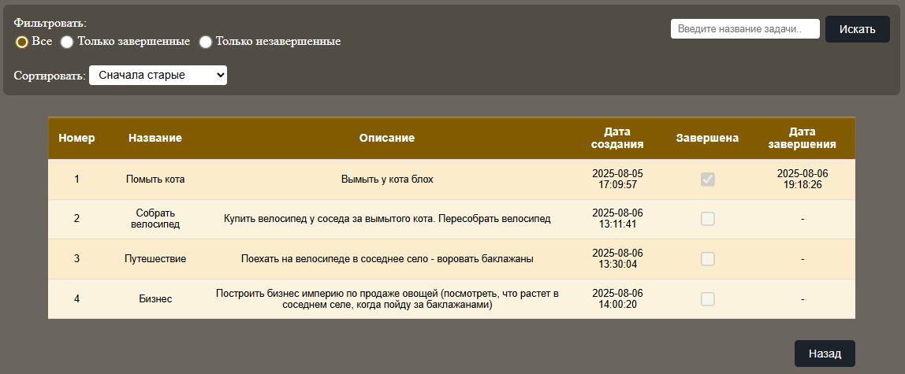
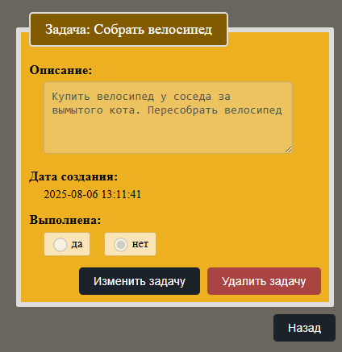
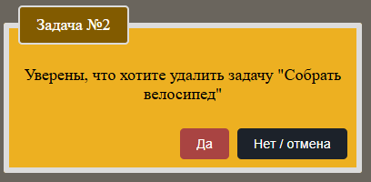
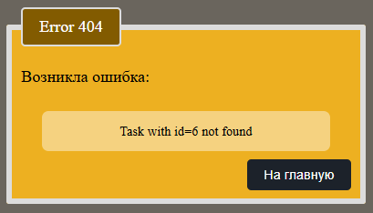

# daily_journal (Flask & FastAPI)

## О проекте
Это приложение для учета продуктивности, реализованное двумя способами: на Flask и на FastAPI.

## Структура проекта
- `flask_version/` — реализация на Flask
- `fastapi_version/` — реализация на FastAPI

## Как запустить
Смотри соответствующий README в нужной папке:
- [Flask README](./flask_version/README.md)
- [FastAPI README](./fastapi_version/README.md)

## Основной функционал

### 1. Авторизация

- После входа данные сохраняются в сессии:
    - Не требуется повторная авторизация
    - Задачи пользователей разделены

---

### 2. Регистрация

- Все поля проходят валидацию:

    - Имя: 4–25 символов
    - Email: 6–36 символов + HTML-проверка
    - Пароль и повтор: совпадают и не пустые
  

---

### 3. Страница пользователя

---

### 4. Создания новой задачи
- Название: 4–25 символов
- Описание: 4–250 символов

---

### 5. Все задачи пользователя

- Функции:
  - Поиск по названию
  - Сортировка: старые/новые, по дате завершения, по алфавиту
  - Фильтр по статусу

 - Чтобы изменить или удалить задачу — нажмите на нее в списке задач.

---

### 6. Просмотр / редактирование задачи

- Кнопка "Изменить задачу" активирует режим редактирования:
  - становится доступным редактирование описания и статуса
  - кнопка меняется на "Сохранить изменения"

- При нажатии на кнопку "Удалить задачу" открывается страница с подтверждением удаления

---

### 7. Подтверждение удаления

---

### 8. Страница ошибки

---

## Лицензия

Проект распространяется без ограничений для личного и учебного использования.
