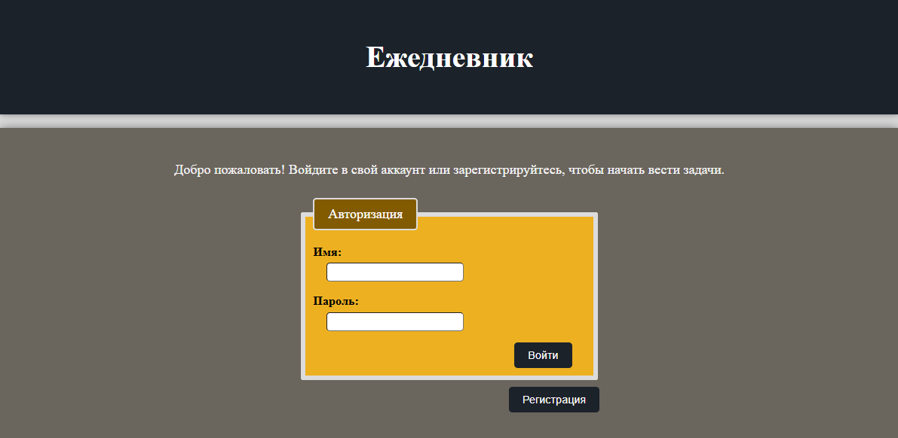
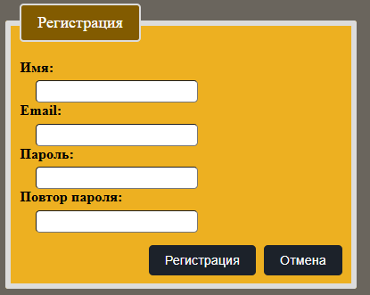
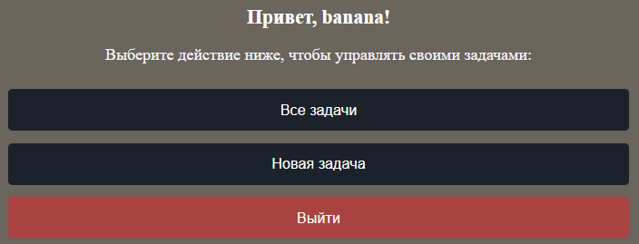
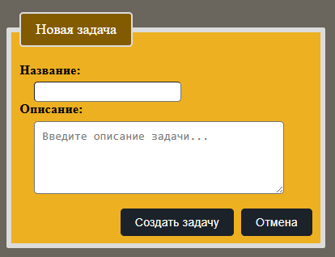
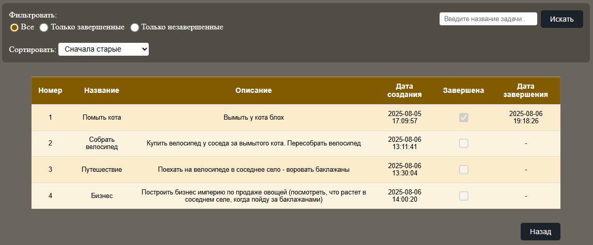
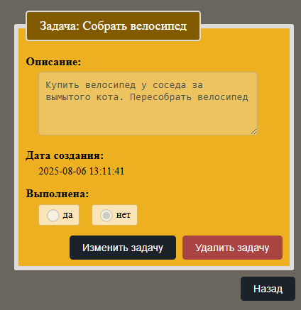
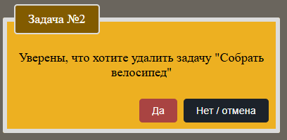
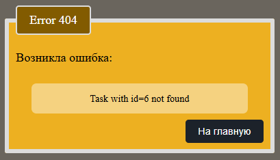

# Daily journal (Flask)

Простое веб-приложение на Flask для отслеживания и управления пользовательских задач.

## Технологии

- Python 3.10+
- Flask ~3.1.1
- HTML / CSS
- Docker (для базы данных)
- WTForms

## Структура проекта
    daily_journal/      
    ├── flask_version                  # Приложение на Flask
    │   ├── api/                       # Роуты приложения
    │   │   ├── __init__.py
    │   │   ├── task.py
    │   │   ├── user.py
    │   │   └── utils.py
    │   ├── core/
    │   │   ├── models/                # Схемы базы данных
    │   │   │   ├── __init__.py
    │   │   │   ├── base.py
    │   │   │   ├── task.py
    │   │   │   └── user.py
    │   │   ├── schemas/               # Схемы валидации wtforms
    │   │   │   ├── __init__.py
    │   │   │   ├── task.py
    │   │   │   └── user.py
    │   │   ├── __init__.py
    │   │   └── config.py
    │   ├── crud/                      # CRUD-операции (доступ к БД)
    │   │   ├── __init__.py
    │   │   ├── task.py
    │   │   └── user.py
    │   ├── images_for_readme/         # Изображения для readme
    │   ├── static/                    # Стили сайта
    │   │   └── style.css
    │   ├── templates/                 # Шаблоны страниц сайта
    │   │   ├── _formhelpers.html
    │   │   ├── create_task.html
    │   │   ├── delete_id.html
    │   │   ├── login.html
    │   │   ├── mistakes.html
    │   │   ├── register.html
    │   │   ├── task_id.html
    │   │   ├── tasks.html
    │   │   └── user_page.html
    │   ├── .env.template             
    │   ├── docker-compose.yml          
    │   ├── main.py                    # Основной файл запуска приложения 
    │   └── README.md
    ├── .gitignore
    ├── poetry.lock
    ├── poetry.toml
    └── README.md


## Установка проекта

1. Клонируйте репозиторий:
    ```
    git clone https://github.com/MelKatya/daily_journal.git
    cd daily_journal/flask_version
    ```

2. Установите зависимости с помощью Poetry:
    ```
    pip install poetry
    poetry install --extras flask
    ```
3. Скопируйте файл .env.template и переименуйте в .env:
   ```
    cp .env.template .env
    ```
    При необходимости — укажите свои параметры подключения к базе данных.

4. Запустите базу данных (Docker):
    ```
    docker-compose up -d
    ```
5. Запустите приложение:

   ```
   python main.py
   ```

6. Откройте в браузере:
   ```
   http://127.0.0.1:5000/
   ```

## Основной функционал

### 1. Авторизация

- После входа данные сохраняются в сессии:
    - Не требуется повторная авторизация
    - Задачи пользователей разделены



---

### 2. Регистрация

- Все поля проходят валидацию:

    - Имя: 4–25 символов
    - Email: 6–36 символов + HTML-проверка
    - Пароль и повтор: совпадают и не пустые
  


---

### 3. Страница пользователя



---

### 4. Создания новой задачи
- Название: 4–25 символов
- Описание: 4–250 символов



---

### 5. Все задачи пользователя

- Функции:
  - Поиск по названию
  - Сортировка: старые/новые, по дате завершения, по алфавиту
  - Фильтр по статусу


 - Чтобы изменить или удалить задачу — нажмите на нее в списке задач.



---

### 6. Просмотр / редактирование задачи

- Кнопка "Изменить задачу" активирует режим редактирования:
  - становится доступным редактирование описания и статуса
  - кнопка меняется на "Сохранить изменения"


- При нажатии на кнопку "Удалить задачу" открывается страница с подтверждением удаления



---

### 7. Подтверждение удаления



---

### 8. Страница ошибки



---

## Лицензия

Проект распространяется без ограничений для личного и учебного использования.
